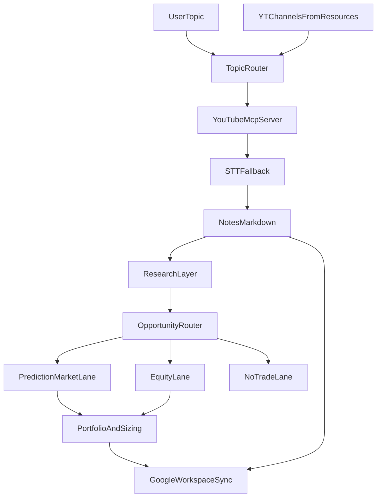

# ROADMAP

這份文件用來整理 `invest-research-agent` 的目前狀態、下一階段方向，以及中長期擴充構想。

目標是把「已完成」、「已確定要做」、「仍在探索」三種內容拆開，避免專案邊界失焦。

## 產品定位

`invest-research-agent` 的核心不是單純下載 YouTube 影片，而是建立一條可重跑的研究管線：

1. 依主題路由到合適頻道
2. 擷取影片內容與字幕
3. 產出結構化研究筆記到 `notes/`
4. 在後續階段，從筆記延伸到外部研究、投資機會判讀與資產配置建議

目前共識：

- `notes/` 是核心落地層（canonical source）
- Google Workspace 不作為主資料庫，而是後續的同步層 / 展示層 / 個人資產層
- Polymarket 不是唯一終點，而是眾多投資機會路線之一

## 整體流程圖

## 已完成

### Phase 1: 核心內容蒐集管線

- 主題驅動的頻道路由
- `resources.yaml` 頻道設定與 `watch_tier` 優先級
- `yt-mcp-server` 整合
- 原生字幕抓取
- 無字幕影片的 STT fallback
- `notes/YYYY-MM-DD/<topic>/` Markdown 筆記輸出
- `channel_state` 狀態管理與去重
- CLI 入口與 smoke test 驗證

### Phase 2: 結構與維運優化

- `resources.yaml` schema 升級為：
  - `yt_channels`：靜態設定
  - `channel_state`：執行期狀態
- `always_watch` 升級為 `watch_tier`
- 文件同步：
  - `README.md`
  - `AGENTS.md`
  - `docs/pre-required.md`

### Phase 3: 研究筆記格式 v1

- `notes/` 已加入固定研究區塊骨架：
  - `核心結論`
  - `重點拆解`
  - `本片回答的問題`
  - `重要依據 / 數據 / 例子`
  - `限制條件 / 前提`
  - `後續追蹤方向`
- 目前採低風險、可重跑的最小自動填充策略：
  - 優先沿用逐字稿片段
  - 避免在主收集流程內直接綁定重型摘要或推理步驟

### Phase 4: 研究層基礎與 enrichment pipeline v0

- 已建立研究層基礎資料模型：
  - claim
  - evidence
  - follow-up question
  - research note section
- 已建立 note parser 與 keyword extraction 的基礎流程
- 已建立獨立的外部研究 enrichment pipeline
- 已建立 RSS provider abstraction 與第一版 CLI 入口
- 架構原則已落地：
  - enrichment 不塞回 `collect_from_topic()` 熱路徑
  - 研究層與蒐集層保持分離

## 目前狀態

已完成的近期進展：

- 主流程硬化：
  - 補強 `video_fetcher`
  - 補強 `dedupe`
  - 補強 CLI smoke 邊界
- 研究筆記格式 v1 已落地
- 研究模型 v0 已落地
- RSS enrichment pipeline v0 已落地

目前正在收斂的重點：

- note 內容品質
- keyword / claim extraction 品質
- external evidence relevance 與排序品質

尚未開始的重點：

- opportunity routing
- Polymarket analyzer
- 股票 / ETF analyzer
- portfolio model
- Google Workspace sync

## 下一階段

### Phase 3: 研究筆記升級

目前狀態：研究筆記 `v1` 結構已完成。

下一步目標：把目前已經有骨架的研究筆記，提升成更適合後續推理與投資研究的高品質中繼筆記。

重點方向：

- 提升 `核心結論` 的品質，避免只停留在逐字稿第一段的近似重述
- 將 `重點拆解` 做得更接近論點層次，而不是逐字稿片段重排
- 提升 `重要依據 / 數據 / 例子` 與實際 claim 的對齊程度
- 把 `限制條件 / 前提`、`後續追蹤方向` 從 placeholder 升級成真正可用的研究欄位

預期成果：

- `notes/` 中的 Markdown 不只是 raw transcript 附帶摘要，而是可供 Agent 後續研究的結構化材料
- 研究筆記內容品質足以承接後續的外部 research 與 opportunity routing

### Phase 4: 外部研究層

目前狀態：外部研究 `v0` 流程已完成，包含獨立 enrichment pipeline、RSS provider abstraction 與 CLI 入口。

下一步目標：提升外部 research 的資料品質與映射能力，讓 enrichment 結果更適合承接後續決策。

重點方向：

- 改善 note -> keyword / claim extraction
- 為每個論點提取更穩定的核心關鍵字集合
- 擴充可替換的外部資料 provider abstraction
- 建立 note / claim / evidence 的對應關係
- 定義 enrichment 結果如何回寫或附加到研究產物

第一階段建議優先：

- RSS / 正式新聞 API
- 專家評論或公開文章來源

暫不建議預設：

- 直接爬一般 Google 搜尋頁面

## 已明確方向，但尚未實作

### Phase 5: 投資機會路由器

目標：不要把最終分析終點綁死在 Polymarket，而是先判斷哪一種投資路線最適合承接該論點。

規劃中的路線：

- `prediction_market`
  - 例如 Polymarket
- `us_equity`
  - 美股 / ETF / 產業 proxy
- `tw_equity`
  - 台股 / ETF / 概念股
- `macro_only`
  - 有研究價值，但暫時沒有明確投資標的
- `no_trade`
  - 不形成可執行投資機會

核心原則：

- 先做 `opportunity routing`
- 再交給對應的 analyzer
- 不要預設所有觀點都一定能落到 Polymarket

### Phase 6: Polymarket 路線

Polymarket 是重要路線之一，但不是唯一目標。

可用資源：

- 官方 CLI：[Polymarket CLI](https://github.com/Polymarket/polymarket-cli.git)
- 官方 Agent Skill：[Polymarket Agent Skills](https://github.com/Polymarket/agent-skills.git)
- 官方 Agent：[Polymarket Agents](https://github.com/Polymarket/agents.git)

定位建議：

- 正式 pipeline：優先用 API / provider abstraction 直接整合資料
- CLI / Skill：作為人工研究、驗證與除錯輔助

第一階段想做的能力：

- 市場搜尋
- 事件 / market 映射
- 最新賠率 / 隱含機率
- 價量與契約描述輔助解讀

第一階段不做：

- 自動下單
- 錢包整合
- 真實資金交易

### Phase 7: 股票與 ETF 路線

目標：從 YouTube 論點出發，找到真正受益的台股 / 美股 / ETF，而不是只沾題材邊的標的。

核心原則：

- 先生成候選標的
- 再做「受益真實性驗證」

預期標的分類：

- `direct_beneficiary`
- `indirect_beneficiary`
- `narrative_correlated`
- `theme_adjacent`

只有前兩類應該進入正式投資分析。

要驗證的重點：

- 題材是否能連到公司營收或利潤
- 受益是直接還是間接
- 時間軸是否合理
- 是否存在更直接的受益者

## 技術調查紀錄

### Gemini 作為 STT provider 的可行性

調查背景：

- 目前專案已支援：
  - 本機 STT：`speaches`、`qwen3-asr`
  - OpenAI-compatible 雲端 STT：`OpenAI`、`Groq`
- 問題在於：Gemini 的音訊轉文字能力是否能直接沿用目前 OpenAI-compatible STT 介面接入。

本次調查結論：

- Gemini 確實具備音訊理解與轉寫能力，包含 transcription、translation、timestamps 等能力。
- 但 Gemini 目前不應視為「可直接替換現有 Whisper-style `/audio/transcriptions` 端點」的 provider。
- 現有專案的 STT 實作，核心假設是：
  - `POST /audio/transcriptions`
  - multipart file upload
  - `response_format=verbose_json`
  - `timestamp_granularities[]`
- Gemini 的官方主路徑比較接近：
  - 原生 Gemini API：`Files API + generate_content`
  - Vertex AI OpenAI compatibility：`chat.completions + input_audio`
- 換句話說，Gemini 雖然有 OpenAI-compatible 的部分介面，但目前不等於 Whisper STT endpoint compatible。

目前決策：

- 先不把 Gemini 納入現階段 STT provider。
- 若未來要接 Gemini，應新增獨立的 `gemini` 或 `vertex-gemini` adapter，而不是硬塞進目前的 `openai-compatible transcription` 實作。
- 若需求是「正式、穩定、專用」的 Google STT 路線，未來也可另外評估 `Google Cloud Speech-to-Text`，但它同樣不是現有 Whisper-compatible 介面。

後續若重啟此題，建議先回答三個問題：

- 目標是要「最少改動擴充 provider」，還是要「引入更強的多模態音訊理解」？
- 是否接受為 Gemini 額外維護一條專用 client / adapter？
- 是否更適合直接評估 Google 的專用 STT 產品，而不是 Gemini 多模態模型？

## 後續再探索

### Phase 8: 個人資產資料與配置模型

目標：讓後續的 Kelly sizing 或其他風控邏輯，能讀取使用者個人資產狀況。

目前共識：

- 先建立專案內部的資產資料模型
- 再決定要從哪裡讀寫

不建議：

- 一開始就把 Google Workspace 當核心資料層

比較合理的方式：

- 專案內部保留 canonical portfolio model
- Google Sheets 作為外部同步與維護入口

### Phase 9: Google Workspace 同步層

可用資源：

- 官方 CLI：[Google Workspace CLI](https://github.com/googleworkspace/cli.git)

建議定位：

- Docs：研究報告與週報
- Sheets：資產表、投資機會表、Kelly 試算
- Drive：歸檔與分享

不建議做法：

- 直接把 Google Workspace 當主資料庫

建議做法：

- `notes/` 保留核心研究資料
- 將最終整理後的報告或表格同步到 Google Workspace

## 執行優先順序

### P0

- 維持目前主流程穩定
- 把 `collect-from-topic --dry-run` 與 smoke checklist 文件化
- 確保後續優化不破壞收集鏈路

### P1

- 提升研究筆記內容品質
- 改善 keyword / claim extraction
- 強化 RSS / 外部資料 evidence 品質與排序
- 讓 research artifacts 更適合作為後續 analyzer 的輸入

### P2

- 定義更正式的 claim / evidence / research artifact 流程
- 規劃 opportunity routing 的輸入介面
- 為後續 Polymarket 與股票 / ETF 路線建立穩定邊界

### P3

- 實作投資機會路由器
- 先接 Polymarket 與股票 / ETF 兩條路線
- 建立 portfolio model
- 再決定如何與 Google Sheets / Docs 做同步

## 暫定不做

- 自動真實下單
- 將整個專案核心資料層遷移到 Google Workspace
- 用單一市場（例如 Polymarket）作為所有研究的唯一終點
- 只靠題材關聯就直接推薦股票，不驗證實際受益能力
