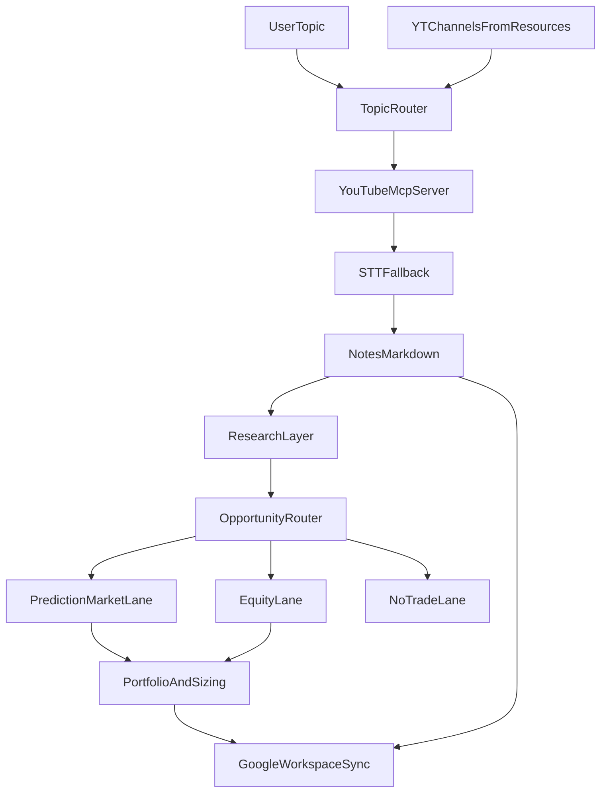

# ROADMAP

這份文件用來整理 `invest-research-agent` 的目前狀態、下一階段方向，以及中長期擴充構想。

目標是把「已完成」、「已確定要做」、「仍在探索」三種內容拆開，避免專案邊界失焦。

## 產品定位

`invest-research-agent` 的核心不是單純下載 YouTube 影片，而是建立一條可重跑的研究管線：

1. 依主題路由到合適頻道
2. 擷取影片內容與字幕
3. 產出結構化研究筆記到 `notes/`
4. 在後續階段，從筆記延伸到外部研究、投資機會判讀與資產配置建議

目前共識：

- `notes/` 是核心落地層（canonical source）
- Google Workspace 不作為主資料庫，而是後續的同步層 / 展示層 / 個人資產層
- Polymarket 不是唯一終點，而是眾多投資機會路線之一

## 整體流程圖

## 已完成

### Phase 1: 核心內容蒐集管線

- 主題驅動的頻道路由
- `resources.yaml` 頻道設定與 `watch_tier` 優先級
- `yt-mcp-server` 整合
- 原生字幕抓取
- 無字幕影片的 STT fallback
- `notes/YYYY-MM-DD/` Markdown 筆記輸出
- `channel_state` 狀態管理與去重
- CLI 入口與 smoke test 驗證

### Phase 2: 結構與維運優化

- `resources.yaml` schema 升級為：
  - `yt_channels`：靜態設定
  - `channel_state`：執行期狀態
- `always_watch` 升級為 `watch_tier`
- 文件同步：
  - `README.md`
  - `AGENTS.md`
  - `docs/pre-required.md`

## 下一階段

### Phase 3: 研究筆記升級

目標：把目前偏精簡的影片筆記，升級成更適合後續推理與投資研究的中繼筆記。

重點方向：

- 補強 `核心結論`
- 將 `重點摘要` 升級成更有層次的 `重點拆解`
- 補出：
  - 本片回答了哪些問題
  - 重要依據 / 數據 / 例子
  - 限制條件 / 前提
  - 後續追蹤方向

預期成果：

- `notes/` 中的 Markdown 不只是摘要，而是可供 Agent 後續研究的結構化材料

### Phase 4: 外部研究層

目標：針對筆記中整理出的觀點，自動找外部資料做交叉驗證。

重點方向：

- 從單影片或主題批次中抽出論點與關鍵字
- 為每個論點提取 3 個左右核心關鍵字
- 建立可替換的外部資料 provider abstraction

第一階段建議優先：

- RSS / 正式新聞 API
- 專家評論或公開文章來源

暫不建議預設：

- 直接爬一般 Google 搜尋頁面

## 已明確方向，但尚未實作

### Phase 5: 投資機會路由器

目標：不要把最終分析終點綁死在 Polymarket，而是先判斷哪一種投資路線最適合承接該論點。

規劃中的路線：

- `prediction_market`
  - 例如 Polymarket
- `us_equity`
  - 美股 / ETF / 產業 proxy
- `tw_equity`
  - 台股 / ETF / 概念股
- `macro_only`
  - 有研究價值，但暫時沒有明確投資標的
- `no_trade`
  - 不形成可執行投資機會

核心原則：

- 先做 `opportunity routing`
- 再交給對應的 analyzer
- 不要預設所有觀點都一定能落到 Polymarket

### Phase 6: Polymarket 路線

Polymarket 是重要路線之一，但不是唯一目標。

可用資源：

- 官方 CLI：[Polymarket CLI](https://github.com/Polymarket/polymarket-cli.git)
- 官方 Agent Skill：[Polymarket Agent Skills](https://github.com/Polymarket/agent-skills.git)

定位建議：

- 正式 pipeline：優先用 API / provider abstraction 直接整合資料
- CLI / Skill：作為人工研究、驗證與除錯輔助

第一階段想做的能力：

- 市場搜尋
- 事件 / market 映射
- 最新賠率 / 隱含機率
- 價量與契約描述輔助解讀

第一階段不做：

- 自動下單
- 錢包整合
- 真實資金交易

### Phase 7: 股票與 ETF 路線

目標：從 YouTube 論點出發，找到真正受益的台股 / 美股 / ETF，而不是只沾題材邊的標的。

核心原則：

- 先生成候選標的
- 再做「受益真實性驗證」

預期標的分類：

- `direct_beneficiary`
- `indirect_beneficiary`
- `narrative_correlated`
- `theme_adjacent`

只有前兩類應該進入正式投資分析。

要驗證的重點：

- 題材是否能連到公司營收或利潤
- 受益是直接還是間接
- 時間軸是否合理
- 是否存在更直接的受益者

## 後續再探索

### Phase 8: 個人資產資料與配置模型

目標：讓後續的 Kelly sizing 或其他風控邏輯，能讀取使用者個人資產狀況。

目前共識：

- 先建立專案內部的資產資料模型
- 再決定要從哪裡讀寫

不建議：

- 一開始就把 Google Workspace 當核心資料層

比較合理的方式：

- 專案內部保留 canonical portfolio model
- Google Sheets 作為外部同步與維護入口

### Phase 9: Google Workspace 同步層

可用資源：

- 官方 CLI：[Google Workspace CLI](https://github.com/googleworkspace/cli.git)

建議定位：

- Docs：研究報告與週報
- Sheets：資產表、投資機會表、Kelly 試算
- Drive：歸檔與分享

不建議做法：

- 直接把 Google Workspace 當主資料庫

建議做法：

- `notes/` 保留核心研究資料
- 將最終整理後的報告或表格同步到 Google Workspace

## 執行優先順序

### P0

- 穩定目前主流程
- 補強研究筆記格式，讓 `notes/` 更適合作為後續分析輸入

### P1

- 建立外部研究層
- 定義論點、證據、機會路由的資料模型
- 先做主題批次分析，再支援單影片下鑽

### P2

- 實作投資機會路由器
- 先接 Polymarket 與股票 / ETF 兩條路線

### P3

- 建立 portfolio model
- 再決定如何與 Google Sheets / Docs 做同步

## 暫定不做

- 自動真實下單
- 將整個專案核心資料層遷移到 Google Workspace
- 用單一市場（例如 Polymarket）作為所有研究的唯一終點
- 只靠題材關聯就直接推薦股票，不驗證實際受益能力
