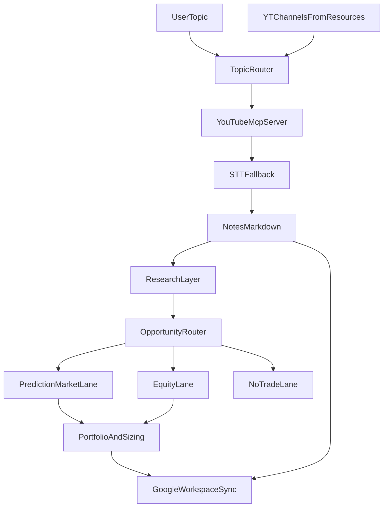

# ROADMAP

這份文件用來整理 `invest-research-agent` 的目前狀態、下一階段方向，以及中長期擴充構想。

目標是把「已完成」、「已確定要做」、「仍在探索」三種內容拆開，避免專案邊界失焦。

## 產品定位

`invest-research-agent` 的核心不是單純下載 YouTube 影片，也不是自己做出一個獨立 agent 產品，而是建立一條可重跑、可被現成 coding agent 框架有效利用的研究管線：

1. 依主題路由到合適頻道
2. 擷取影片內容與字幕
3. 產出結構化研究筆記到 `notes/`
4. 在後續階段，從筆記延伸到外部研究、投資機會判讀與資產配置建議

目前共識：

- `notes/` 是核心落地層（canonical source）
- Google Workspace 不作為主資料庫，而是後續的同步層 / 展示層 / 個人資產層
- Polymarket 不是唯一終點，而是眾多投資機會路線之一
- 目前研究流程的資料來源先限縮在使用者自行維護的 `resources.yaml`
- 當 `resources.yaml` 資訊不足時的自主擴充來源能力，屬於未來功能，不是現階段優先項目

### 目前想像的實際使用場景

使用者會以主題或問題驅動方式向 Agent 發出研究請求，例如：

- `幫我研究台股最新熱門族群`
- `幫我研究最近 AI 技術趨勢`
- `幫我分析最近熱門話題可能延伸出的投資機會`

現階段預期流程：

1. Agent 先根據使用者問題，從 `resources.yaml` 中挑選最相關的既有 YouTube 頻道
2. Agent 擷取相關頻道的最新影片內容，取得字幕或透過 STT 產生逐字稿
3. Agent 將逐字稿整理為 transcript / analysis artifact / note / research artifact 等中繼層
4. Agent 再根據 research artifact 與 claim-level enrichment，逐步推進到研究摘要、商業理解、熱門主題判讀與潛在投資機會分析

這代表現階段產品的核心，不是「全網自主搜尋資訊」，而是「在使用者定義好的可信來源集合內，建立可重跑、可追溯、可逐步深化的研究流程」。

## 整體流程圖

## 已完成

### Phase 1: 核心內容蒐集管線

- 主題驅動的頻道路由
- `resources.yaml` 頻道設定與 `watch_tier` 優先級
- `yt-mcp-server` 整合
- 原生字幕抓取
- 無字幕影片的 STT fallback
- `notes/YYYY-MM-DD/<topic>/` Markdown 筆記輸出
- `channel_state` 狀態管理與去重
- CLI 入口與 smoke test 驗證

### Phase 2: 結構與維運優化

- `resources.yaml` schema 升級為：
  - `yt_channels`：靜態設定
  - `channel_state`：執行期狀態
- `always_watch` 升級為 `watch_tier`
- 文件同步：
  - `README.md`
  - `AGENTS.md`
  - `docs/pre-required.md`

### Phase 3: 研究筆記格式 v1

- `notes/` 已加入固定研究區塊骨架：
  - `核心結論`
  - `重點拆解`
  - `本片回答的問題`
  - `重要依據 / 數據 / 例子`
  - `限制條件 / 前提`
  - `後續追蹤方向`
- 目前採低風險、可重跑的最小自動填充策略：
  - 優先沿用逐字稿片段
  - 避免在主收集流程內直接綁定重型摘要或推理步驟

### Phase 4: 研究層基礎與 enrichment pipeline v0

- 已建立研究層基礎資料模型：
  - claim
  - evidence
  - follow-up question
  - research note section
- 已建立 note parser 與 keyword extraction 的基礎流程
- 已建立獨立的外部研究 enrichment pipeline
- 已建立 RSS provider abstraction 與第一版 CLI 入口
- 架構原則已落地：
  - enrichment 不塞回 `collect_from_topic()` 熱路徑
  - 研究層與蒐集層保持分離

## 目前狀態

已完成的近期進展：

- 主流程硬化：
  - 補強 `video_fetcher`
  - 補強 `dedupe`
  - 補強 CLI smoke 邊界
- 研究筆記格式 v1 已落地
- 研究模型 v0 已落地
- RSS enrichment pipeline v0 已落地

目前正在收斂的重點：

- note 內容品質
- keyword / claim extraction 品質
- external evidence relevance 與排序品質
- research artifact / claim-level enrichment 與最終 user-facing answer 之間的接合品質

### 最新實測觀察（2026-04-11）

以真實問題「我想要知道最新一集股癌有沒有討論到哪些熱門的投資標的、熱門族群」進行 Gemini CLI 實測後，得到一個很重要的產品結論：

- 目前 `transcript -> analysis artifact -> note -> research artifact -> claim-level enrichment` 這條中繼資料鏈，已經比早期更完整
- 但最終對使用者輸出的回答，仍然很像「讀完單集筆記後的摘要整理」，而不是明確建立在 claims / evidence / uncertainty 邊界上的研究型輸出
- 換句話說，目前改善較多的是 machine-readable 中介層，不是最終 answer synthesis 體驗本身

這代表現階段的主要落差，已不只是 artifact 結構夠不夠，而是：

- Agent 最後怎麼根據 research artifact 回答使用者問題
- 怎麼區分「節目直接提到」與「Agent 推導」
- 怎麼把 claim、source、evidence、uncertainty 更清楚地呈現在最終回答裡
- 怎麼讓「熱門族群 / 熱門標的」這類問題的輸出更接近研究結論，而不只是節目摘要

尚未開始的重點：

- opportunity routing
- Polymarket analyzer
- 股票 / ETF analyzer
- portfolio model
- Google Workspace sync

## 下一階段

### Phase 3: 研究筆記升級

目前狀態：研究筆記 `v1` 結構已完成，但目前的 note 仍偏向「有固定骨架的整理輸出」，真正的內容品質仍高度依賴 transcript 與 analysis artifact 的品質。

下一步目標：把目前已經有骨架的研究筆記，提升成更適合後續推理與投資研究的高品質中繼筆記。

核心判斷：

- 目前專案的主要瓶頸不是「抓不到內容」，而是「研究中繼層品質還不夠穩」
- 真正需要優化的重心，應放在 `transcript -> analysis artifact -> note -> research artifact -> claim-level enrichment` 這條鏈路，而不是先擴更多資料來源或更早進入投資 analyzer
- `notes/` 很適合作為 human-readable 的 canonical layer，但後續機器推理不應只直接依賴 Markdown note 本身

重點方向：

- 提升 `核心結論` 的品質，避免只停留在逐字稿第一段的近似重述
- 將 `重點拆解` 做得更接近論點層次，而不是逐字稿片段重排
- 提升 `重要依據 / 數據 / 例子` 與實際 claim 的對齊程度
- 把 `限制條件 / 前提`、`後續追蹤方向` 從 placeholder 升級成真正可用的研究欄位
- 讓 note 更明確扮演「高品質研究筆記輸出層」，而不是摘要骨架本身

預期成果：

- `notes/` 中的 Markdown 不只是 raw transcript 附帶摘要，而是可供 Agent 後續研究的結構化材料
- 研究筆記內容品質足以承接後續的外部 research 與 opportunity routing
- note 內容會更穩定地反映 analysis artifact 的 thesis、claims、evidence、assumptions 與 open questions

Phase 3 的具體優化原則：

- 優先提升 analysis artifact 品質，再讓 note generator 吃到更好的中繼資料
- 不把重型研究品質提升直接塞回 `collect_from_topic()` 熱路徑
- 保持 collect pipeline 可重跑、低風險、穩定；把重分析能力放在後處理流程

### Phase 4: 外部研究層

目前狀態：外部研究 `v0` 流程已完成，包含獨立 enrichment pipeline、RSS provider abstraction 與 CLI 入口；但目前 enrichment 還偏向 note-level keyword search，而不是 claim-level evidence mapping。

下一步目標：提升外部 research 的資料品質與映射能力，讓 enrichment 結果更適合承接後續決策。

核心判斷：

- 現階段 enrichment 若只靠整篇 note 的 keyword，容易出現 evidence 與實際論點對不上的問題
- 下一步應逐漸把 enrichment 單位從 note-level 提升到 claim-level
- 長期應建立 `claim -> keyword set -> external evidence` 的穩定映射，而不是只做整篇筆記的主題搜尋

重點方向：

- 改善 note -> keyword / claim extraction
- 為每個論點提取更穩定的核心關鍵字集合
- 擴充可替換的外部資料 provider abstraction
- 建立 note / claim / evidence 的對應關係
- 定義 enrichment 結果如何回寫或附加到研究產物
- 將 `support / contradiction / context` 等 evidence 關係視為後續可擴充方向

第一階段建議優先：

- RSS / 正式新聞 API
- 專家評論或公開文章來源
- 先從 claim-level enrichment 的最小版本做起，而不是一次做完整知識圖譜

暫不建議預設：

- 直接爬一般 Google 搜尋頁面
- 一開始就把整個 enrichment 做成重量級多跳推理系統

### Phase 4.5: Research artifact 中介層

目標：在 transcript / analysis / note / enrichment 之間，建立一層更正式的 research artifact，作為後續 opportunity routing 與 analyzer 的穩定輸入。

為什麼要做：

- transcript 太原始
- Markdown note 偏向 human-readable，不適合作為唯一機器輸入
- analysis artifact 與 enrichment result 目前已經是好的基礎，但彼此關係還不夠正式

建議方向：

- 建立一個以 claim 為核心的 research artifact shape
- 讓它能整合：
  - video / topic metadata
  - analysis artifact 的 claims / conclusion
  - video 內部 evidence
  - 外部 evidence
  - open questions / next actions
- 讓後續 analyzer 優先讀 artifact JSON，而不是直接 parse Markdown note

最小可行版本可包含：

- `note_path`
- `transcript_path`
- `topic`
- `title`
- `channel`
- `claims[]`
- `overall_risks[]`
- `next_actions[]`

這一層完成後，後續的 `opportunity routing`、Polymarket analyzer、股票 / ETF analyzer 都會有更穩定的輸入邊界。

但根據 2026-04-11 的真實使用測試，僅有 research artifact 與 claim-level enrichment 還不足以直接讓最終回答品質顯著升級；還需要再補一層更明確的 research answer / synthesis layer，才能把中繼資料層的改善轉化成使用者可感知的研究輸出品質。

## 已明確方向，但尚未實作

### 未來功能：主動擴充資訊來源

這是明確需要存在的能力，但目前不列為眼前優先實作。

目標：當使用者問題超出 `resources.yaml` 已設定的來源範圍時，Agent 可以自主尋找補充來源，並明確附上來源依據與納入理由。

預期能力：

- 判斷目前 `resources.yaml` 是否足以回答使用者問題
- 在既有來源不足時，搜尋補充的 YouTube 頻道、新聞或文章來源
- 對每個新來源保留明確 attribution 與選用理由
- 區分一次性研究來源與應正式納入 `resources.yaml` 的候選來源

目前決策：

- 先不把這項能力整進主流程
- 先把產品邊界收斂在使用者自行維護的 `resources.yaml`
- 等既有 research pipeline、research synthesis 與 analyzer 邊界更穩後，再回來做這項能力

### 建議中的下一個能力：research answer / synthesis layer

目標：讓 Agent 最後回覆使用者研究問題時，不只是整理單支影片摘要，而是能基於 claims / evidence / research artifact 形成更研究化的回答。

這一層預期要做到：

- 針對使用者問題挑選真正 relevant 的 claims，而不是平鋪直敘地摘要整集內容
- 清楚區分「節目直接提到」、「根據節目內容推導」、「仍需進一步驗證」
- 讓最終回答更明確暴露 source、evidence 與 uncertainty 邊界
- 讓「熱門標的 / 熱門族群 / 潛在投資機會」這類問題的輸出，更接近研究結論而不只是節目整理

這個能力目前尚未正式實作，但已經由真實測試證明其必要性。

### 最新方向稽核結論（2026-04-12）

完成一次針對專案定位的稽核後，目前可以確認：

- repo 整體仍對齊「為 Claude Code / Gemini CLI 等 coding agent 提供投資研究 workflow」的核心方向
- 目前最需要修正的不是產品邊界擴張，而是 answer synthesis 這一層的 ownership 還不夠乾淨
- `research-answer-synthesizer` 應成為主要的 synthesis layer，負責根據使用者問題挑選 relevant claims，並區分 direct mention / inferred point / needs validation
- Python / CLI 應退回 deterministic support layer，主要負責 research artifact 讀取、output path、answer JSON persistence 與 rendering，而不是繼續扮演主要 synthesis intelligence

因此下一個聚焦修正，不是新增更大的能力，而是把 research answer workflow 從「Python 先生成、subagent 再補強」收斂成更明確的 `agent-first answer synthesis workflow`。

### Phase 5: 投資機會路由器

目標：不要把最終分析終點綁死在 Polymarket，而是先判斷哪一種投資路線最適合承接該論點。

規劃中的路線：

- `prediction_market`
  - 例如 Polymarket
- `us_equity`
  - 美股 / ETF / 產業 proxy
- `tw_equity`
  - 台股 / ETF / 概念股
- `macro_only`
  - 有研究價值，但暫時沒有明確投資標的
- `no_trade`
  - 不形成可執行投資機會

核心原則：

- 先做 `opportunity routing`
- 再交給對應的 analyzer
- 不要預設所有觀點都一定能落到 Polymarket

目前建議中的最小 routing input 邊界：

- 上游輸入先以 `ResearchAnswer` 為主，而不是直接從 Markdown note 或 transcript 做路由
- routing 優先讀取以下欄位：
  - `summary_answer`：目前最終研究結論與主線摘要
  - `direct_mentions`：影片或來源中明確提到的可追蹤訊號
  - `inferred_points`：由研究 answer layer 推導出的可能主線或機會方向
  - `needs_validation`：尚未足以路由、但值得繼續追蹤的項目
- 一份 answer 至少要有下列其中一種訊號，才視為「可進 routing」：
  - 明確可追蹤的產業 / 政策 / 技術主線
  - 可對應到具體市場、資產類別或事件類型的 inferred point
  - 能明確判斷為僅具研究價值而不形成可交易機會
- 初步判斷建議：
  - `prediction_market`：重點在可被事件化、可對應二元或條件式 outcome 的論點
  - `us_equity`：重點在可連到美股公司、ETF、產業 proxy 的主線
  - `tw_equity`：重點在可連到台股公司、ETF、概念股的主線
  - `macro_only`：有研究價值，但目前只形成總經 / 產業 / 政策觀察，還沒有清楚可交易標的
  - `no_trade`：內容不足、訊號太弱、或主要結論仍停留在待驗證，尚不形成投資機會
- `needs_validation` 不能直接當可交易機會本身，但可以作為 routing 後續的 follow-up queue

### Phase 6: Polymarket 路線

Polymarket 是重要路線之一，但不是唯一目標。

可用資源：

- 官方 CLI：[Polymarket CLI](https://github.com/Polymarket/polymarket-cli.git)
- 官方 Agent Skill：[Polymarket Agent Skills](https://github.com/Polymarket/agent-skills.git)
- 官方 Agent：[Polymarket Agents](https://github.com/Polymarket/agents.git)

定位建議：

- 正式 pipeline：優先用 API / provider abstraction 直接整合資料
- CLI / Skill：作為人工研究、驗證與除錯輔助

第一階段想做的能力：

- 市場搜尋
- 事件 / market 映射
- 最新賠率 / 隱含機率
- 價量與契約描述輔助解讀

第一階段不做：

- 自動下單
- 錢包整合
- 真實資金交易

### Phase 7: 股票與 ETF 路線

目標：從 YouTube 論點出發，找到真正受益的台股 / 美股 / ETF，而不是只沾題材邊的標的。

核心原則：

- 先生成候選標的
- 再做「受益真實性驗證」

預期標的分類：

- `direct_beneficiary`
- `indirect_beneficiary`
- `narrative_correlated`
- `theme_adjacent`

只有前兩類應該進入正式投資分析。

要驗證的重點：

- 題材是否能連到公司營收或利潤
- 受益是直接還是間接
- 時間軸是否合理
- 是否存在更直接的受益者

## 技術調查紀錄

### Gemini 作為 STT provider 的可行性

調查背景：

- 目前專案已支援：
  - 本機 STT：`speaches`、`qwen3-asr`
  - OpenAI-compatible 雲端 STT：`OpenAI`、`Groq`
- 問題在於：Gemini 的音訊轉文字能力是否能直接沿用目前 OpenAI-compatible STT 介面接入。

本次調查結論：

- Gemini 確實具備音訊理解與轉寫能力，包含 transcription、translation、timestamps 等能力。
- 但 Gemini 目前不應視為「可直接替換現有 Whisper-style `/audio/transcriptions` 端點」的 provider。
- 現有專案的 STT 實作，核心假設是：
  - `POST /audio/transcriptions`
  - multipart file upload
  - `response_format=verbose_json`
  - `timestamp_granularities[]`
- Gemini 的官方主路徑比較接近：
  - 原生 Gemini API：`Files API + generate_content`
  - Vertex AI OpenAI compatibility：`chat.completions + input_audio`
- 換句話說，Gemini 雖然有 OpenAI-compatible 的部分介面，但目前不等於 Whisper STT endpoint compatible。

目前決策：

- 先不把 Gemini 納入現階段 STT provider。
- 若未來要接 Gemini，應新增獨立的 `gemini` 或 `vertex-gemini` adapter，而不是硬塞進目前的 `openai-compatible transcription` 實作。
- 若需求是「正式、穩定、專用」的 Google STT 路線，未來也可另外評估 `Google Cloud Speech-to-Text`，但它同樣不是現有 Whisper-compatible 介面。

後續若重啟此題，建議先回答三個問題：

- 目標是要「最少改動擴充 provider」，還是要「引入更強的多模態音訊理解」？
- 是否接受為 Gemini 額外維護一條專用 client / adapter？
- 是否更適合直接評估 Google 的專用 STT 產品，而不是 Gemini 多模態模型？

## 後續再探索

### Phase 8: 個人資產資料與配置模型

目標：讓後續的 Kelly sizing 或其他風控邏輯，能讀取使用者個人資產狀況。

目前共識：

- 先建立專案內部的資產資料模型
- 再決定要從哪裡讀寫

不建議：

- 一開始就把 Google Workspace 當核心資料層

比較合理的方式：

- 專案內部保留 canonical portfolio model
- Google Sheets 作為外部同步與維護入口

### Phase 9: Google Workspace 同步層

可用資源：

- 官方 CLI：[Google Workspace CLI](https://github.com/googleworkspace/cli.git)

建議定位：

- Docs：研究報告與週報
- Sheets：資產表、投資機會表、Kelly 試算
- Drive：歸檔與分享

不建議做法：

- 直接把 Google Workspace 當主資料庫

建議做法：

- `notes/` 保留核心研究資料
- 將最終整理後的報告或表格同步到 Google Workspace

## 執行優先順序

### P0

- 維持目前主流程穩定
- 把 `collect-from-topic --dry-run` 與 smoke checklist 文件化
- 確保後續優化不破壞收集鏈路

### P1

- 提升 analysis artifact 品質，讓 `core_conclusion`、`key_points`、`evidence_points` 更接近 thesis / claims / supporting evidence
- 提升研究筆記內容品質
- 改善 keyword / claim extraction
- 把 enrichment 從 note-level keyword search 逐步升級為 claim-level enrichment
- 強化 RSS / 外部資料 evidence 品質與排序
- 讓 research artifacts 更適合作為後續 analyzer 的輸入
- 建立一小組代表性影片的人工評測集，用來評估 note / claim / evidence 品質是否真的提升

### P2

- 定義更正式的 claim / evidence / research artifact 流程
- 建立 `research artifact v1` 的最小穩定 schema
- 規劃 opportunity routing 的輸入介面
- 為後續 Polymarket 與股票 / ETF 路線建立穩定邊界
- 明確區分 human-readable note 與 machine-readable artifact 的責任

### P3

- 實作投資機會路由器
- 先接 Polymarket 與股票 / ETF 兩條路線
- 建立 portfolio model
- 再決定如何與 Google Sheets / Docs 做同步

## 暫定不做

- 自動真實下單
- 將整個專案核心資料層遷移到 Google Workspace
- 用單一市場（例如 Polymarket）作為所有研究的唯一終點
- 只靠題材關聯就直接推薦股票，不驗證實際受益能力
